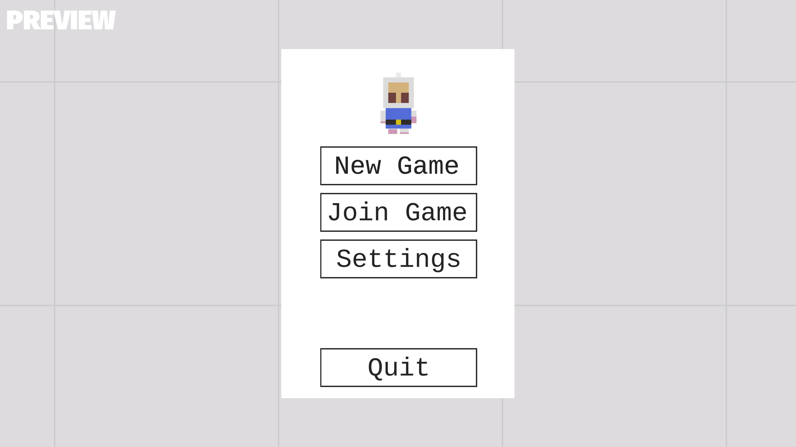
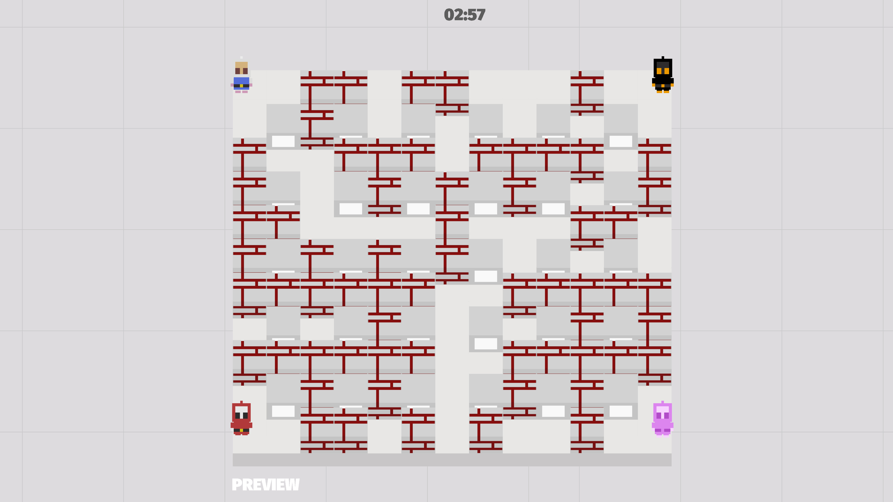
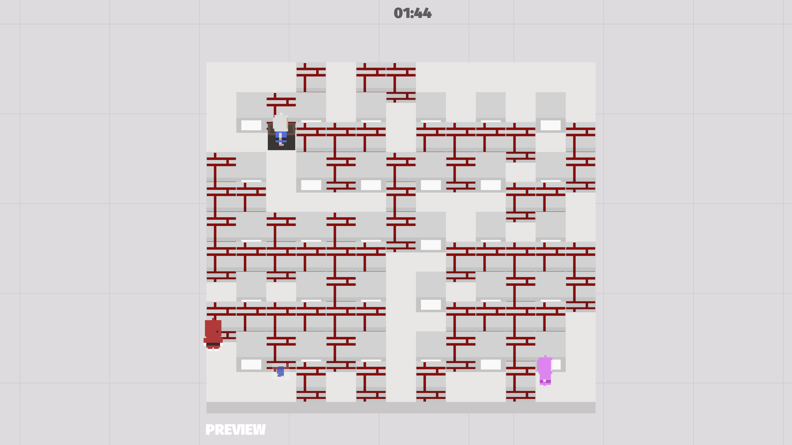

# Eksplode.re

**Eksplode.re** is a Bomberman game made with [Godot](https://godotengine.org) under BSD3.

This is, for now, a personal project. I just want to have some fun. I think Bomberman can have a lot of new game modes. However, everybody who wants to improve the game is welcome!

**DISCLAIMER** This is a project done in my spare time (and my first using Godot), mostly when drinking some maté. The code is really ugly for now, I just want to play. Also, I am not a designer nor a sound designer. However this is some ideas I want to implement:

+ Some bots, because if you don't have friends you can't play
+ Gamemode: The Werewolves of Millers Hollow
+ Gamemode: Team Fortress 2
+ Gamemode: Chaser (one player try to kill the others)

## Screenshots

## Name

https://en.wiktionary.org/wiki/eksplodere

## Build instructions

### Godot

Just install `Godot` and open `project.godot`. Then, you can do whatever you want.

### GNU/Linux

Because it's the platform I use as a daily basis, I will generate binaries for this platform. The binaries are available via the [Releases page](https://github.com/AmarOk1412/Eksplode.re/releases) (AppImages, *x86_64*).

If you want to build your own (I don't do reproducible builds for now):

1. Install `appimagetool` (https://appimage.github.io/appimagetool/). Note: rename the binary to `appimagetool` and it must be in your `$PATH`.
2. Generate `Eksplode.re.x86_64` and `Eksplode.re.pck` via Godot in `/bin`
3. Go in the `packaging` directory
4. `sh build-appimage.sh`
5. Enjoy!

## Android

+ https://docs.godotengine.org/en/stable/getting_started/workflow/export/exporting_for_android.html

## Contribute

Please, feel free to contribute to this project in submitting patches, corrections, opening issues, etc.

If you don't know what you can do, you can look the [Issue page](https://github.com/AmarOk1412/Eksplode.re/issues).

For more infos and ideas read [CONTRIBUTING.md](/CONTRIBUTING.md) (this file doesn't exists for now) and [CODE_OF_CONDUCT.md](/CODE_OF_CONDUCT.md).
